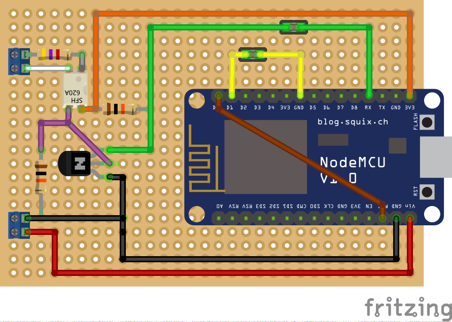

# Teleinfo to MQTT

Code is AS-IS without any warranty of any kind...

Hardware used :
* Nodemcu 1.0 (but any ESP8266 breakout with enough pins should do)
* Optocoupler SFH620A (but LTV-814 could be even better)
* 2N7000 or BS170
* 2 * 10k + 1 * 4.7 resistors

Corresponding blog entry: http://www.guillier.org/blog/2017/xxxxxxx
